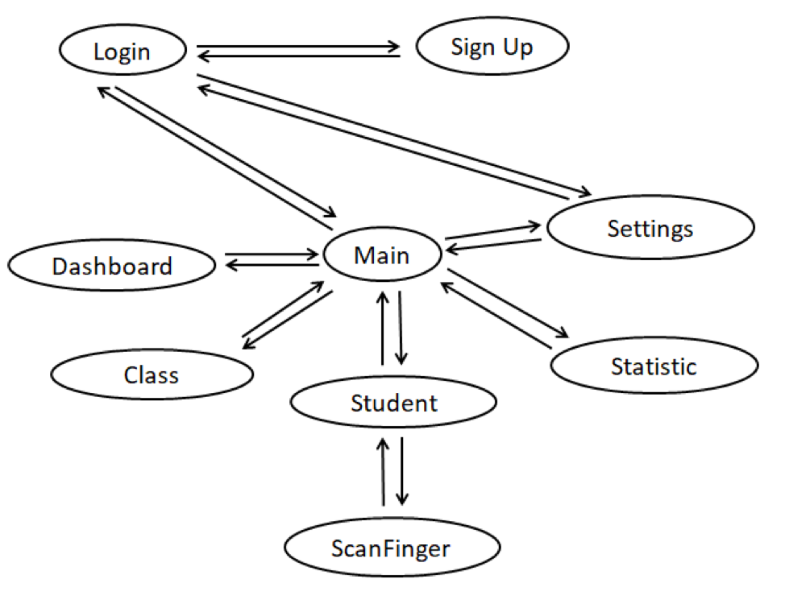
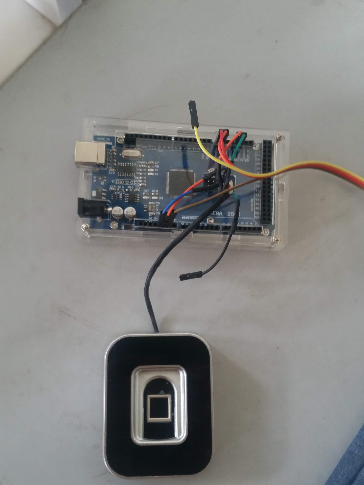
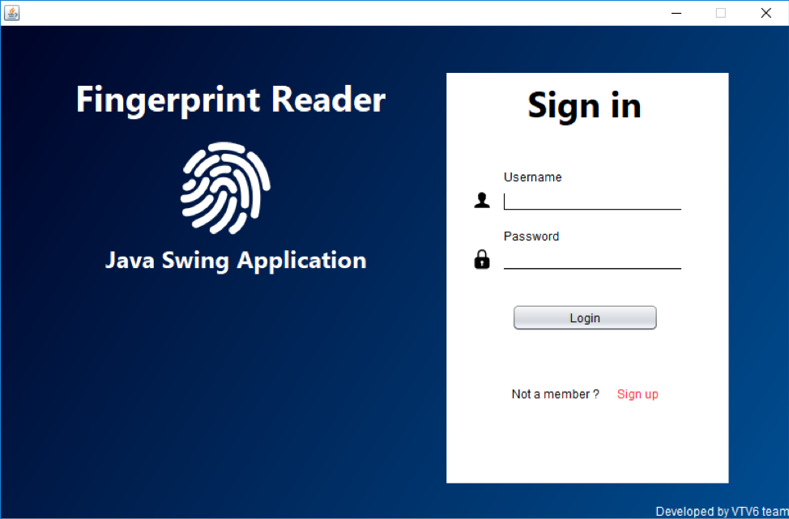
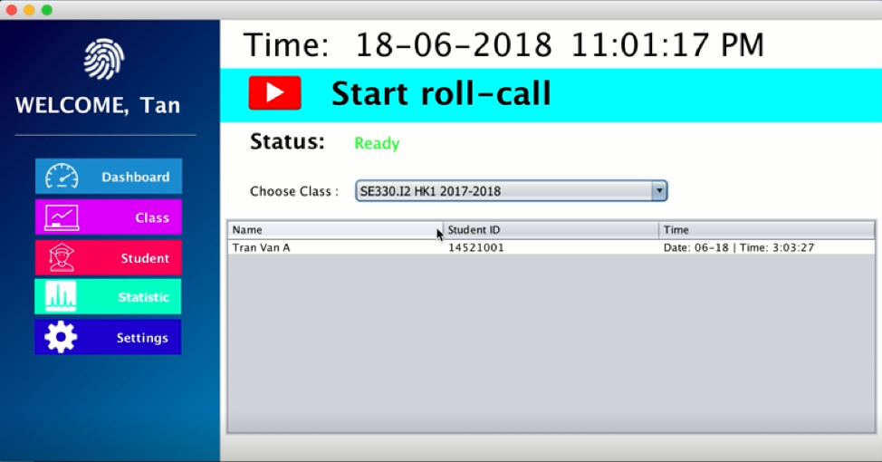
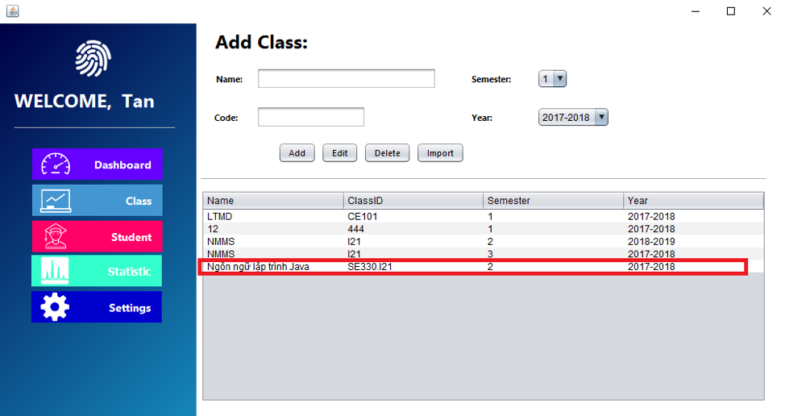
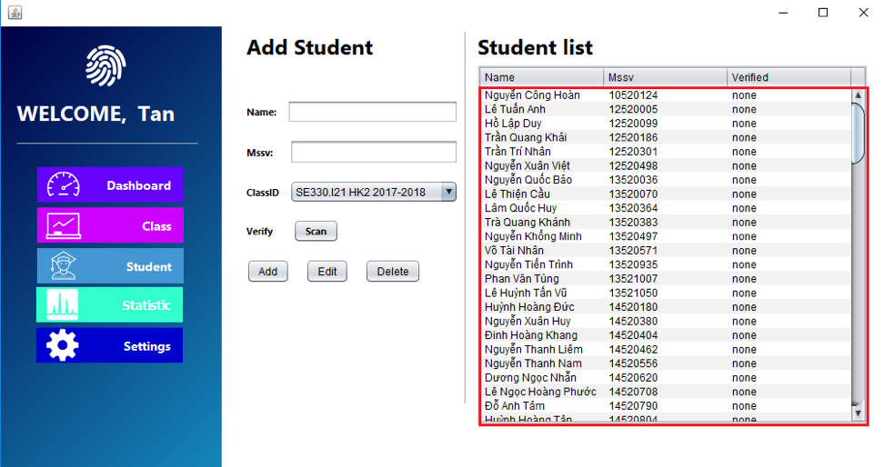
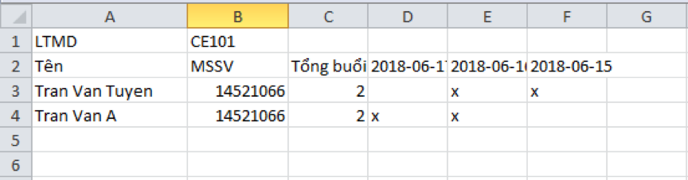
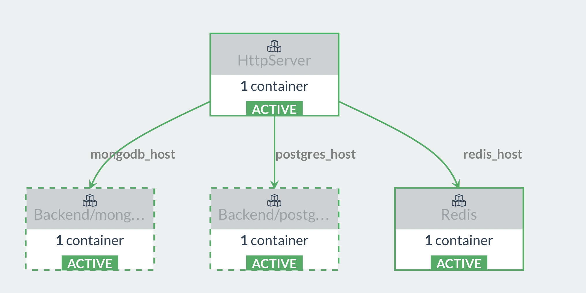

# Attendence System

Attendence System là phần mềm điểm danh chạy trên nền java sử dụng cảm biến vân trắc học vân tay.

  - Nhận diện chính xác bằng xác thực vân tay
  - Dữ liệu được đồng bộ với cloud server
  - Dữ liệu được tổng hợp và hỗ trợ xuất ra file

# Features!

  - Đăng kí
  - Đăng nhập
  - Quản lý lớp
  - Quản lý học sinh
  - Quét vân tay
  - Xem thống kê, xuất file báo cáo

## Built With

* [Java jdk](http://www.oracle.com/technetwork/java/javase/downloads/jdk8-downloads-2133151.html) - Java SE Development Kit 8
* [Netbean](https://netbeans.org/downloads/) - NetBeans IDE
* [Gin](https://rometools.github.io/rome/) - HTTP web framework written in Go (Golang) 
*  [Docker](https://www.docker.com) - Software containerization platform
* [Rancher](https://rancher.com) - Run containers in production

## Screenshoot

## Link demo
* [Attendence System Demo](https://youtu.be/fVrKl7UyIOw) - 
